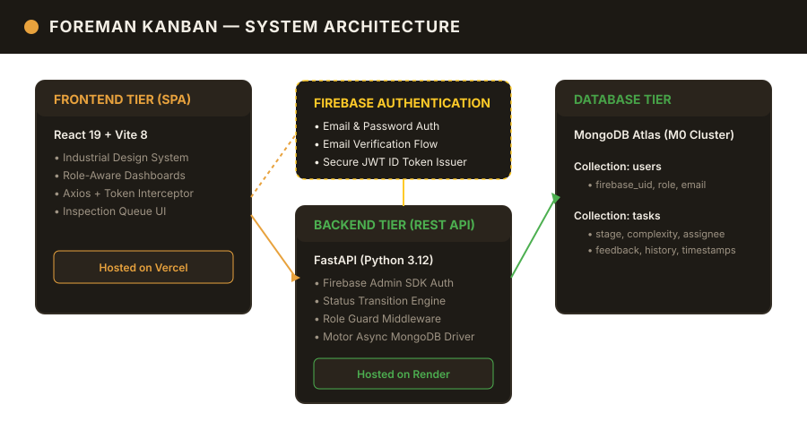
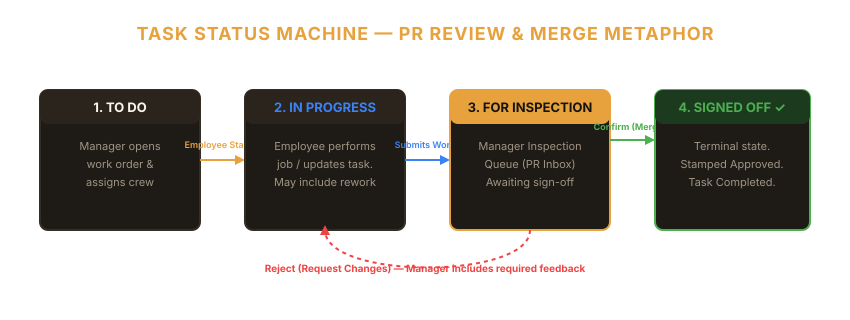
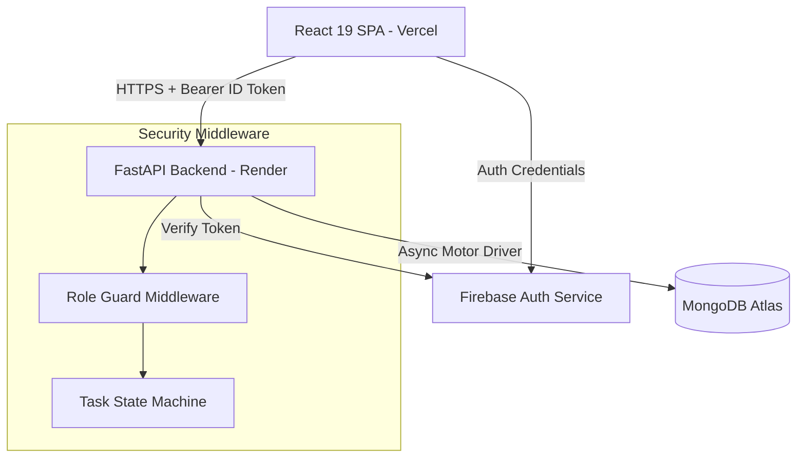

# Foreman Kanban

> **Collaborative, role-based task board with physical inspection workflows — modeling software pull-request reviews in an industrial work-order system.**

[](https://foreman-kanban.vercel.app/)
[](LICENSE)
[](https://fastapi.tiangolo.com)
[](https://react.dev)
[](https://www.docker.com)

---

## Visual Demo & System Workflows

> **Visuals before source code:** Recruiter glance summary under 30 seconds.



### Task State Machine & Inspection Workflow


---

## Overview & Motivation

Traditional Kanban tools (like Trello or Jira) suffer from accountability gaps: any team member can drag a card to "Done" without peer review or verification.

**Foreman Kanban** solves this by introducing a strict **Inspection & Approval Workflow** inspired by Git pull-request review cycles:
- **Managers** open work orders, set task complexity (Low, Medium, High), assign crew members, and inspect completed jobs.
- **Employees** view assigned work, start jobs, and submit completed tasks for manager inspection.
- Work is **never "Done"** until a Manager explicitly signs off. If work fails inspection, the Manager sends it back with required rejection feedback for rework.

Built with an industrial "Foreman" design system featuring dark wood panels, amber accents, paper-textured tickets, pin-board metaphors, and interactive stamp animations (`APPROVED` vs `SENT BACK`).

---

## Core Features

- 🔐 **Role-Based Access Control (RBAC):** Server-enforced roles (`manager` vs `employee`) via Firebase Auth ID tokens and MongoDB bindings.
- ⚙️ **Strict State Machine Engine:** Validates transitions (`todo` → `in_progress` → `submitted_for_review` → `done`). Prevents illegal jumps or employee self-approval.
- 📥 **Manager Inspection Queue:** A dedicated "PR Inbox" where managers approve or reject pending submissions with feedback.
- 📌 **Paper Ticket UI & Stamp Animations:** Tactile industrial UI with complexity indicators and approval/rejection stamps.
- 🐳 **Full DevOps Infrastructure:** Containerized with multi-stage Dockerfiles, orchestrated via Docker Compose, and packaged with minikube Kubernetes manifests (`k8s/`).
- ⚡ **Automated CI/CD:** GitHub Actions workflows for continuous integration (`ci.yml`) and continuous cloud deployment (`cd.yml`).

---

## Tech Stack

| Layer | Technology | Hosting / Deployment |
|-------|-----------|----------------------|
| **Frontend** | React 19, Vite 8, React Router DOM 7, Vanilla CSS | [Vercel](https://foreman-kanban.vercel.app/) |
| **Backend** | Python 3.12, FastAPI 0.115, Motor Async Driver, Pydantic v2 | Render |
| **Database** | MongoDB Atlas (M0 Free Cluster) | MongoDB Cloud |
| **Auth** | Firebase Authentication (Email/Password + Bearer ID Token verification) | Firebase Cloud |
| **DevOps** | Docker, Docker Compose, Kubernetes (minikube), GitHub Actions CI/CD | GitHub / Cloud |

---

## Architecture Overview



For comprehensive technical design documents, data schemas, and ADRs:
- 📑 [System Architecture Details](docs/architecture.md)
- 🔌 [REST API Specification](docs/api.md)
- 💡 [Architecture Decision Records (ADRs)](docs/decisions.md)
- 📜 [Academic Specification Archive](docs/coursework-spec.md)

---

## Installation & Quickstart

### Option A: Local Development (Node & Python)

1. **Clone the repository:**
   ```bash
   git clone https://github.com/sedmugen/foreman-kanban.git
   cd foreman-kanban
   ```

2. **Backend Setup:**
   ```bash
   cd backend
   python -m venv venv
   # Windows: venv\Scripts\activate | Linux/macOS: source venv/bin/activate
   pip install -r requirements.txt
   cp .env.example .env
   uvicorn app.main:app --reload --port 8000
   ```

3. **Frontend Setup:**
   ```bash
   cd frontend
   npm install
   cp .env.example .env
   npm run dev
   ```

### Option B: Docker Compose (Full Stack)

Run the complete multi-container stack (`mongo`, `backend`, `frontend`) with a single command:

```bash
docker-compose up --build
```

Access points:
- **Frontend App:** `http://localhost`
- **Backend API Health:** `http://localhost:8000/api/health`

### Option C: Kubernetes (minikube)

```bash
kubectl apply -f k8s/
```

---

## Usage & Role Workflows

### Manager Workflow
1. Log in with a Manager account.
2. Click **+ New Work Order** to create a task, set complexity, and assign an employee.
3. Track progress on the Job Board.
4. When tasks enter the **Inspection Queue**, click **Confirm** to mark `Done` or **Send Back** with required feedback.

### Employee Workflow
1. Log in with an Employee account.
2. View assigned work orders on your dashboard.
3. Click **Start Job** to move a task from `To Do` to `In Progress`.
4. Click **Submit for Inspection** to request manager review.
5. If sent back, review inline rejection feedback and resubmit when fixed.

---

## Roadmap

- [x] Multi-tier cloud deployment (Vercel + Render + MongoDB Atlas).
- [x] Strict state machine engine & role guard middleware.
- [x] Docker multi-stage containerization & Kubernetes manifests.
- [x] GitHub Actions CI/CD pipelines.
- [ ] Real-time WebSocket notifications for pending inspections.
- [ ] Analytics dashboard for task completion velocity.

---

## License & Credits

This project is licensed under the [MIT License](LICENSE).

### Development Team
- **Ismail** — Team Lead, Integration, Docker/K8s & CI/CD Pipeline
- **Ibrahim** — Backend Engineer, FastAPI, Role Guard & State Machine Logic
- **Saad** — Frontend Engineer, React UI, Firebase Auth & Industrial Design System
